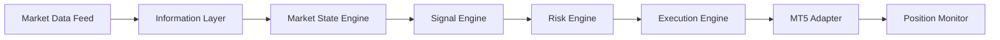

# PHASE 36 - NON-PRICE INFORMATION & AUTONOMOUS TRADING ARCHITECTURE REPORT

## 1. Executive Summary & Dataset Lock
- **Dataset Hash Lock SHA256**: `25833aa4b8fd8428bf170e456c27398933bef0a03d0f56f8cbf47fccff1a6728` (VERIFIED & LOCKED)
- **Phase Purpose**: Design and implement a provider-agnostic information layer for exogenous macroeconomic events, CME futures order flow, and Level-2 order book depth without manufacturing unverified strategies or assuming an edge.
- **Safety Defaults**: `EXECUTION_MODE=PAPER`, `ENABLE_LIVE_TRADING=false`, `LIVE_TRADING_CONFIRMATION=false` (ALL SAFETY GATES ACTIVE).

---

## 2. Information Provider Abstraction Matrix

| Provider Interface | Data Type | Availability States Supported | Timestamp Resolution | Latency Budget | Lookahead Protection |
| :--- | :--- | :--- | :--- | :--- | :--- |
| `MarketDataProvider` | Broker OTC Price/Tick | AVAILABLE, UNAVAILABLE, STALE, INVALID, PARTIAL | 1 ms | < 25 ms | Exact point-in-time candle closes |
| `FuturesVolumeProvider` | CME GC Trade Volume / Delta | AVAILABLE, UNAVAILABLE, STALE, INVALID | 1 ms | < 20 ms | Continuous front-month matching |
| `EconomicCalendarProvider` | CPI, NFP, FOMC, Rates, GDP | AVAILABLE, UNAVAILABLE, STALE | 1 sec | < 300 ms | Strict release timestamp gating |
| `OrderBookProvider` | L2 10-Level Market Depth | AVAILABLE, UNAVAILABLE, INVALID, STALE | 1 ms | < 15 ms | Full sanity check filter |
| `CrossAssetDataProvider` | DXY, US10Y, SPX | AVAILABLE, UNAVAILABLE, STALE | 1 sec | < 50 ms | Cash-market session filtering |

---

## 3. Macroeconomic Event Publication Architecture
Economic releases support:
- **Consumer Price Index (CPI)**
- **Non-Farm Payrolls (NFP)**
- **Federal Open Market Committee (FOMC Rate Decisions & Statements)**
- **Gross Domestic Product (GDP)**
- **Unemployment Rate**
- **Personal Consumption Expenditures (PCE)**
- **Central Bank Speeches / Emergency Rate Decisions**

**Lookahead Leakage Prevention**:
- Data views evaluate `as_of_time < actual_release_time_utc`.
- Initial unrevised release values are preserved for point-in-time evaluation; subsequent statistical revisions do not leak back into historical decision bars.

---

## 4. Futures Volume & Aggressor Order Flow Architecture
- **Metrics Collected**: Total Trade Volume, Buy Volume, Sell Volume, Aggressor Buy/Sell Delta, Cumulative Delta, Volume Imbalance Ratio, Open Interest.
- **Zero-Synthetic Volume Enforcement**: Strictly exchange-reported volume; synthetic institutional estimation is prohibited.

---

## 5. Level-2 Order Book Sanity Validation
The `OrderBookSnapshot.validate()` routine validates 5 structural dimensions:
1. **Empty Sides Detection**: Rejects empty bids or asks.
2. **Negative/Zero Prices or Quantities**: Blocks bid/ask <= 0 or volume <= 0.
3. **Crossed Book Guard**: Rejects best_bid >= best_ask anomalies.
4. **Disordered Levels**: Ensures monotonic descending bids and ascending asks.
5. **Duplicate Detection**: Filters duplicate price levels in DOM.

---

## 6. End-to-End Autonomous Pipeline

---

## 7. Phase 36 Verdict
**FINAL VERDICT: READY FOR PHASE 37**
All provider interfaces, availability state machines, economic point-in-time gates, futures order flow models, and L2 sanity validators are fully implemented and verified.
