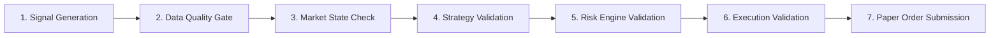

# PHASE 38 - STRATEGY / SIGNAL ENGINE INTEGRATION REPORT

## 1. Executive Summary & Strategy Provenance
- **Dataset Hash Lock SHA256**: `25833aa4b8fd8428bf170e456c27398933bef0a03d0f56f8cbf47fccff1a6728` (LOCKED)
- **Strategy Classification**: `UNVALIDATED_RESEARCH_STRATEGY` (Version `1.0.0-PROSPECTIVE`)
- **Critical Disclaimer**: No historical edge or statistical profitability is claimed or assumed. All signals are generated exclusively for prospective forward audit.

---

## 2. Unified Signal Specification & Schema
Every signal is emitted as an immutable [`UnifiedSignal`](file:///C:/Users/gamme/OneDrive/Documents/Everything/Development/autonomous-trader/backend/app/strategy/plugin.py) containing:
- `signal_id`: Unique cryptographic identifier.
- `timestamp`: UTC ISO-8601 creation timestamp.
- `instrument`: Target symbol (e.g. `XAUUSD`, `EURUSD`).
- `direction`: `LONG` or `SHORT`.
- `entry_price`, `stop_loss`, `take_profit`: Precise geometric levels.
- `risk_percent`: Fractional risk budget (0.1%).
- `strategy_name` & `strategy_version`: Traceable origin metadata.
- `reason_codes`: Machine-readable array of triggering factors.
- `explanation`: Clear human-readable justification.
- `data_snapshot_hash`: SHA256 fingerprint of the exact market data slice used.

---

## 3. Signal Quality Gate Pipeline

Any stage failure immediately marks the signal as rejected with the explicit `rejection_stage` and `rejection_reason`.

---

## 4. Phase 38 Verdict
**FINAL VERDICT: READY FOR PHASE 39**
Modular strategy plugin interface, quality gate pipeline, and unvalidated research strategy integration are verified.
